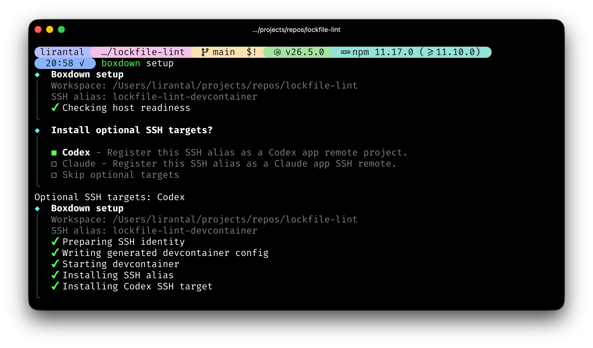

<!-- markdownlint-disable -->

<p align="center">
  <h1 align="center">
    boxdown
  </h1>
</p>

<p align="center">
  Start and SSH into a reusable Dev Container environment for any local project.
</p>

<p align="center">
  <a href="https://www.npmjs.com/package/boxdown"></a>
  <a href="https://www.npmjs.com/package/boxdown"></a>
  <a href="https://www.npmjs.com/package/boxdown"></a>
  <a href="https://github.com/lirantal/boxdown/actions/workflows/ci.yml"></a>
  <a href="https://app.codecov.io/gh/lirantal/boxdown"></a>
  <a href="./SECURITY.md"></a>
  
</p>



## Install

```sh
npm install -g boxdown
```

You can also run it without installing:

```sh
npx boxdown setup
```

## Usage

From any project repository on your host:

```sh
npx boxdown setup
```

Boxdown builds or reuses a Dev Container for the current directory and installs
an SSH alias for remote tools. The target repository stays clean; Boxdown writes
generated configuration and SSH keys under user cache/data directories instead
of copying `.devcontainer/` into the project.

Startup commands print concise progress by default. With interactive `--verbose`,
Boxdown shows a detailed lifecycle trace. CI and non-interactive contexts stream
raw managed-command output. Boxdown also keeps one append-only per-workspace
command log under its data directory; `boxdown status` shows the exact path.
Interactive shell, agent, and tunnel session bytes are not tee'd into the log.

Open an interactive shell inside the container when you need one:

```sh
npx boxdown start
```

Choose workspace toolchains during setup. Boxdown detects supported root-level
Node.js, Python, Go, and Rust declarations, then lets you confirm or override
the versions it provisions inside the container:

```sh
npx boxdown setup --toolchain auto
npx boxdown start --toolchain node@24.17.0 --toolchain python
```

Interactive setup shows an editable selection. In scripts, selectors are
explicit: omitted `--toolchain` values report detections but select nothing.
See [Workspace toolchains](./docs/features/toolchains.md) for marker precedence,
release-pinned defaults, status, retry, and legacy-workspace recreation.

Boxdown ships and invokes its own `@devcontainers/cli` dependency. It does not require a host/global Dev Containers CLI install.

## Boxdown Demo

<https://github.com/user-attachments/assets/2c53a4c7-13d9-4b81-8540-b0ab6a624f35>

### Published devcontainer image

New containers pull the public release-matched image
`ghcr.io/lirantal/boxdown:<Boxdown-version>` instead of building Dev Container
Features or shared tools locally. The first uncached use needs network access,
but does not need a GHCR login. The image contains the default Codex, Claude
Code, Snyk, 1Password, and AMD64 APM tools; OpenCode and Antigravity remain
lazy installs when their respective Boxdown commands run.

The image never contains your workspace or credentials. Boxdown adds those only
at container creation through mounts and runtime state. Codex and Claude keep
their throttled best-effort refreshes after startup, so their packaged versions
can advance between Boxdown releases.

Snyk, 1Password, and AMD64 APM advance with a Boxdown release and require a
container recreation to take effect. APM is intentionally deferred on ARM64
until you explicitly opt in to a Python-based installation. Existing
workspaces keep their current container until you run `boxdown start --recreate`
or `boxdown setup --recreate`.

### FAQ

#### Why does Boxdown say my workspace uses a “legacy locally-built Dev Container image”?

The workspace was created by an older Boxdown version that built its Dev
Container image locally. It remains usable and Boxdown does not change it
automatically. Run `boxdown setup --recreate` or `boxdown start --recreate` to
replace it with Boxdown's current published image.

## What Boxdown manages

### Outside your repository

Boxdown stores generated devcontainer configuration under its cache root.
Per-workspace metadata, SSH keys, and redacted command log live under its data
roots. It keeps a per-workspace runtime root for runtime-secret state separate
from persistent data. It does not copy a `.devcontainer` directory into the
target repository; all generated state remains outside the target repository.

For generated-state details, see [Generated configuration and state](./docs/features/generated-config-and-state.md).

### Container inputs

The host checkout is the Dev Container workspace: the Dev Containers CLI
bind-mounts it writable at `/workspaces/<repo-name>`, so edits made inside the
container are edits to the host checkout.

Boxdown additionally mounts its packaged assets, public SSH key, host Git-config
snapshot, and runtime-secret directory read-only. The Git-config snapshot is
copied to a writable `/home/node/.gitconfig` during container creation; the host
file is never edited.

When SSH commit signing is enabled, Boxdown mounts the host SSH-agent socket at
`/run/boxdown/ssh-agent.sock` and mounts public signing-key state read-only at
`/opt/boxdown/state/git-signing`. Private signing keys remain on the host.

### Agent profiles

Agent profiles control host user-scoped coding-agent data. Choose one when a
command creates or recreates a container:

```sh
npx boxdown setup --agent-profile full
npx boxdown start --agent-profile none|auth|full
```

`auth` is the default. Repository-scoped configuration remains visible through
the normal workspace mount in every tier, including committed `AGENTS.md`,
`CLAUDE.md`, `.agents`, `.codex`, `.claude`, and `.mcp.json` files.

During interactive `boxdown setup`, selecting or explicitly supplying at least
one Codex or Claude app target opens a single-choice agent profile prompt unless
`--agent-profile` was supplied. An explicit `--agent-profile` suppresses this
prompt. Skipping every app target keeps the workspace's recorded profile, or
`auth` for a new workspace, without another prompt. Non-interactive setup never
asks.

Use both flags for a fully explicit setup:

```sh
boxdown setup --target codex --agent-profile auth
```

App registration and profile exposure are separate: choosing profile `none`
still allows app registration, and profiles are container-wide rather than
filtered to the selected app.

| CLI | Contents |
| --- | --- |
| `none` | no host user-scoped agent profile or Claude API key |
| `auth` | file-backed auth, Claude API key, complete `~/.agents` |
| `full` | live, read-write host Codex/Claude homes plus `~/.agents` |

`auth` mounts selected host sources only at read-only staging paths, then makes
a container-local writable copy on container creation. `full` instead mounts the
live host `/home/node/.agents`, `/home/node/.codex`, and `/home/node/.claude`
profiles read-write. Changes made inside the container to a `full` profile write
to the host profile immediately; this is intentional and there is no copy or
reverse synchronization layer.

`full` uses live, read-write host mounts.

On macOS, Claude credentials stored in Keychain are not copied. `auth` and
`full` can still expose an `ANTHROPIC_API_KEY` already available through
Boxdown's runtime-secret mechanism; otherwise Claude starts unauthenticated in
that container.

Choose `full` only when you need host user-scoped Codex or Claude configuration
such as MCP definitions. It exposes live complete homes, which can include
sensitive history, settings, plugins, and credentials and lets the container
change them on the host immediately. It can also retain broken host paths or
native dependencies that do not run in the container. Put portable user-scoped
MCP configuration in the repository instead, and never use `full` for an
untrusted workspace.

A custom mount at, above, or below a canonical agent-home destination is
externally managed. Boxdown skips its staging and copy for that destination so
it does not replace the custom mount. The mount owner is responsible for its
contents and write policy.

This changes the previous forwarding model: `auth` no longer exposes host Codex
config, Boxdown no longer creates a Claude MCP projection, and the supported
Claude credential is no longer a writable host mount. Existing containers keep
their previous configuration until recreated.

Recreate the container when changing `--agent-profile` or full-profile mount
configuration, or when refreshing copied `auth` sources. Changes to live `full`
profiles are already visible to a running container.
`boxdown status` reports the exact generated paths for a workspace.

### Host integrations

`boxdown setup` manages a workspace SSH alias. It writes Codex or Claude app
integration records only when you select or explicitly request those targets.

### Cleanup boundary

The `stop`, `down`, and `purge` commands define the cleanup boundary.

`boxdown stop` keeps the container and all Boxdown state, including its copied
`auth` profile; a `full` profile remains in its host location. Restarting the
same container preserves its `auth` profile changes. `boxdown down` removes the
container and its copied `auth` profile along with per-workspace runtime-secret
state. `boxdown start --recreate` seeds a new `auth` copy from current host
sources; it does not remove a live `full` host profile. `down`
retains persistent cache/data state: metadata, SSH keys, generated config, and
command log. `boxdown purge` removes the workspace's Boxdown-managed container,
recorded image, generated state, command log, and managed SSH/app integrations;
it never removes repository files.

For lifecycle details, see [Container lifecycle](./docs/features/lifecycle.md).

### Portless SSH

`boxdown setup` installs an SSH alias for the current project. To only install
or update that alias without starting the devcontainer, use the lower-level SSH
command:

```sh
npx boxdown ssh install
```

This creates a `<repo-name>-devcontainer` SSH host. When run in an interactive
terminal, Boxdown also asks whether to install optional targets such as Codex
and Claude.
Non-interactive runs skip optional targets and print the explicit `--target`
form to use in scripts.

Validate the SSH alias with:

```sh
ssh <repo-name>-devcontainer 'whoami && pwd'
```

Use the same alias in Cursor, Claude, Codex, or any SSH-capable tool.

To also add the project to Codex's remote project sidebar or Claude's SSH
remote list, pass one or more targets during setup or select them from the
lower-level SSH prompt:

```sh
npx boxdown setup --target codex
npx boxdown setup --target claude
```

The lower-level SSH command also supports the same targets for scripts:

```sh
npx boxdown ssh install --target codex
npx boxdown ssh install --target claude
```

Restart the target app after installing it so it applies the updated remote
project config.

From the target project directory, forward a dev server running inside the
container to your host browser:

```sh
npx boxdown tunnel --port 3030
```

If `--port` is omitted in an interactive terminal, Boxdown asks which port or
port mappings to forward and defaults to the generated devcontainer published
port when available. Non-interactive runs still require `--port`.

This keeps a foreground SSH tunnel open until you press Ctrl-C. The host and
Codex in-app browser can then open `http://localhost:3030/`. Repeat `--port`
or use `<local:remote>` mappings when needed:

```sh
npx boxdown tunnel --port 3030 --port 8080:3031
```

Use `--workspace <path>` only when running the command from a different
directory. Repeat it with `down` to remove multiple workspace containers in one
command. When `down` runs from a directory that is not a known Boxdown
workspace, interactive terminals show a workspace picker instead.

Remove one app integration while keeping the SSH alias, or remove the alias and
all known integrations when you no longer need it:

```sh
npx boxdown ssh uninstall --target claude
npx boxdown ssh uninstall --target codex
npx boxdown ssh uninstall
```

`--target` is repeatable and removes only the selected agent integration; the
Boxdown-managed SSH alias remains in place. Omitting `--target` removes the
alias and all known integrations.

### Commands

```sh
boxdown setup
boxdown start
boxdown codex
boxdown claude
boxdown opencode
boxdown antigravity
boxdown list
boxdown status
boxdown stop
boxdown down
boxdown purge
boxdown doctor
boxdown ssh install
boxdown ssh uninstall
boxdown ssh-proxy
boxdown tunnel --port 3030
boxdown refresh-gh-token
```

`boxdown shell` remains supported as an alias for `boxdown start`, but
documentation uses `start` as the canonical command.
`boxdown cc` remains supported as an alias for `boxdown claude`, but
documentation uses `claude` as the canonical command.

`boxdown setup` begins with a host-readiness preflight before it prompts for
SSH targets, writes workspace state, or starts Docker work. Required failures
such as an unavailable Docker daemon stop setup with an actionable summary.
When a local Docker image is available, the preflight also performs a no-pull,
no-start bind-mount probe for the workspace and Boxdown-managed mount paths.
Run `boxdown doctor` directly for the complete diagnostic report; an unavailable
best-effort mount probe is reported as a warning and does not block setup.

`boxdown start` is standalone: it can create or reuse the devcontainer even if
`boxdown setup` was skipped or its preflight failed. Setup-only SSH aliases and
Codex/Claude application integrations are still installed only by `setup`.

Before a command creates or starts a container, Boxdown waits up to 60 seconds
for the Docker daemon and the selected Docker Buildx builder. If Buildx is not
installed, the bundled Dev Containers CLI uses its supported classic-build
fallback and Boxdown continues with a warning. Boxdown does not retry an actual
Dev Containers build failure.

Container bring-up pulls the release-matched image, which includes Codex and
Claude Code by default. The OpenCode and Antigravity commands stay available,
but install/update those CLIs only when you launch them. Use `--` to pass
arguments to the selected agent:

```sh
boxdown claude -- --continue
```

On supported Linux/WSL and Windows hosts, Boxdown forwards the documented
Claude Code credential file automatically. Run Claude Code and complete `/login`
on the host, then run `boxdown start --recreate` to add the new mount.
On Linux/WSL, container creation also synchronizes the remote user's UID/GID so
owner-only host credentials remain writable; this can add a small create-time
cost.

List Boxdown-known devcontainer environments from any directory:

```sh
boxdown list
boxdown list --details
boxdown list --json
boxdown list --format json
```

Human `boxdown list` output shows `STATE`, `REPO`, `PATH`, and `CONTAINER`.
Use `boxdown list --details` when you need full copyable paths and SSH aliases
in human output. Use `boxdown list --json` or `boxdown list --format json` for
the same structured inventory.

Shared options:

```sh
--workspace <path>  # target project directory, defaults to cwd; repeatable with down; purge also accepts list values
--alias <name>      # SSH alias, defaults to <repo-name>-devcontainer
--target <name>     # with setup/ssh install/ssh uninstall, optional target; repeatable; supported: codex, claude
--port <port>       # tunnel port for `boxdown tunnel`; repeatable
--recreate          # recreate the devcontainer before starting
--agent-profile <tier> # host agent data: none, auth (copied; default), or full (live read-write mounts)
--toolchain <selector> # with setup/start; repeatable: auto, none, <runtime>, or <runtime>@<version>
--json              # JSON output for status and list
--format json       # JSON output for status and list; equivalent to --json
--details           # detailed human output for list
```

Use `boxdown purge` when you want to remove the workspace's Boxdown-managed
environment residue: the devcontainer, its exact recorded Docker image, managed
SSH/Codex/Claude entries, command log, and Boxdown cache/data for that
workspace. It does not delete the local repository directory or files inside it.
Interactive terminals ask for confirmation before purging.

For `purge`, `--workspace` accepts the `PATH` or unambiguous `REPO` value
shown by `boxdown list`. It also accepts exact `SSH ALIAS` values from
`boxdown status`, `boxdown list --details`, or JSON list output:

```sh
boxdown purge
boxdown purge --workspace my-repo-devcontainer
boxdown purge --workspace my-repo
boxdown purge --workspace /path/to/my-repo
```

When `boxdown purge` runs without `--workspace` from a directory that is not a
tracked Boxdown workspace, interactive terminals show a multi-select list of all
tracked workspaces, including missing/stale entries. The focused row highlights
the state token: `running` is green, `exited` is yellow, and `absent`,
`missing`, or `unknown` are red. Non-interactive runs fail safely from
untracked directories; scripts should call `boxdown purge --workspace <value>`
for each workspace.

## Contributing

Please consult [CONTRIBUTING](./CONTRIBUTING.md) for guidelines on contributing to this project.

## Author

**boxdown** © [Liran Tal](https://github.com/lirantal), Released under the [Apache-2.0](./LICENSE) License.
